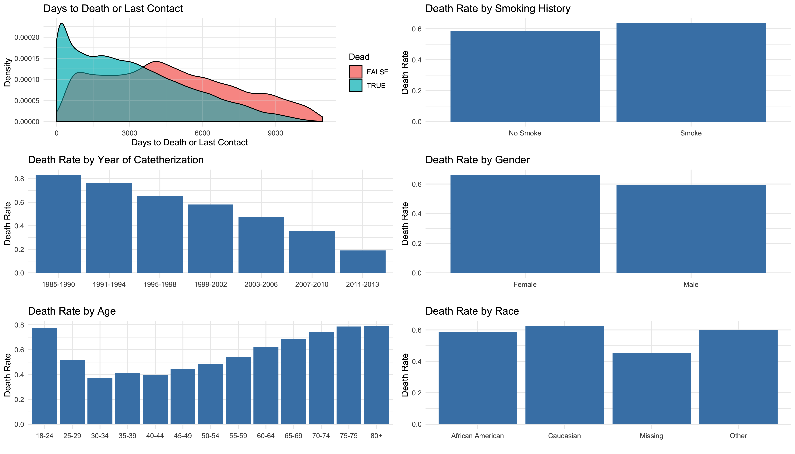
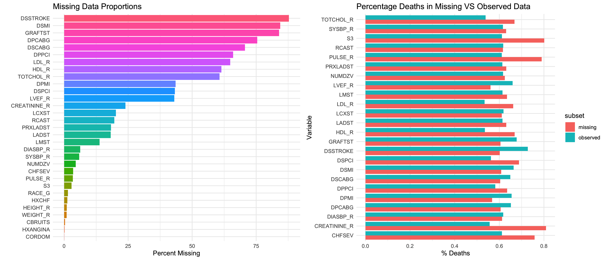
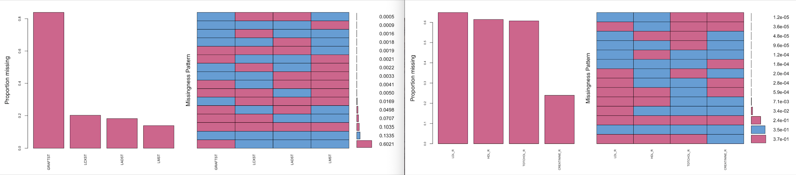
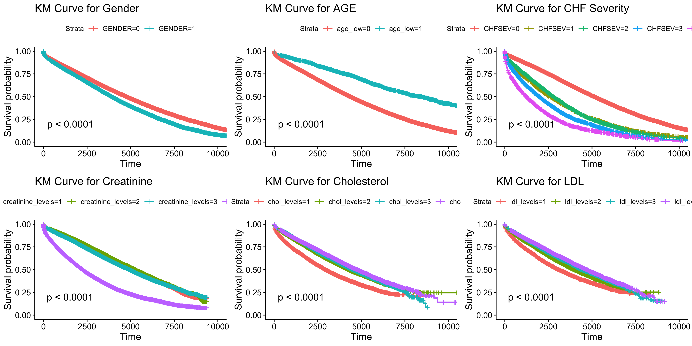
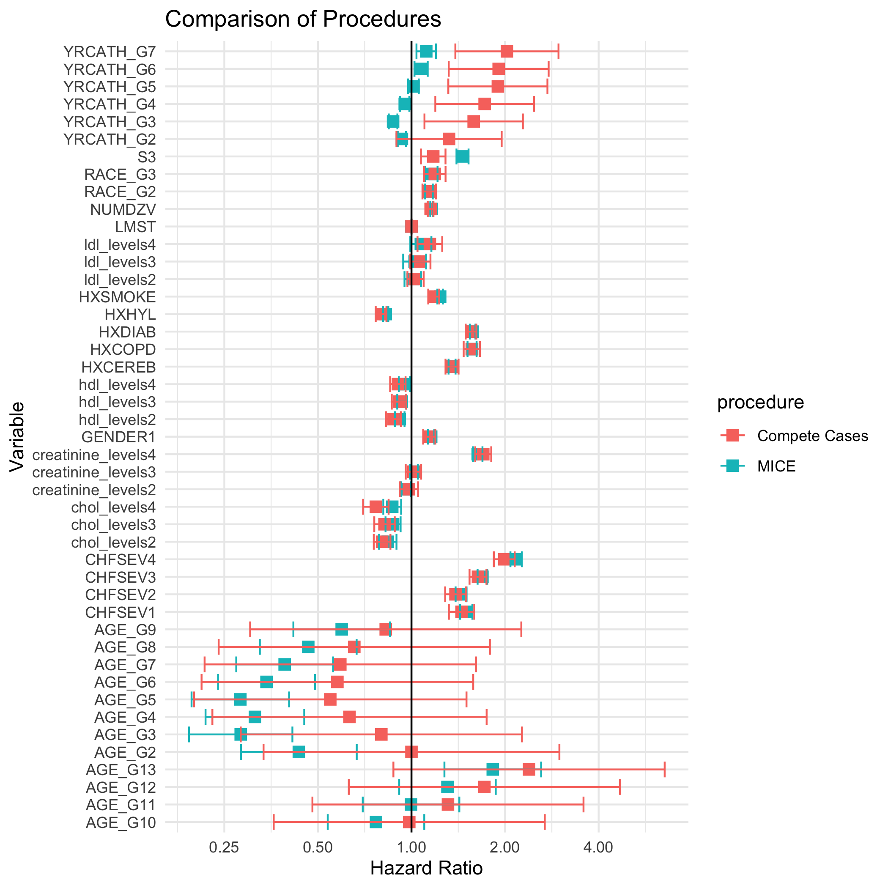

```{r, echo = FALSE, message = FALSE, warning = FALSE}
library(haven)
library(dplyr)
library(ggplot2)
library(gridExtra)
library(xtable)
library(xgboost)
library(randomForest)
library(twang)
library(VIM)
library(lattice)
library(mice)
library(survival)
library(survminer)


cardio = read.csv("data/dukecathr.csv")
 
# CATEGORICAL OR BINARY VARIABLES:
cardio$DEATH = as.factor(cardio$DEATH)
cardio$GENDER = as.factor(cardio$GENDER)

knitr::opts_chunk$set(echo = FALSE, message = FALSE, warning = FALSE)

select = dplyr::select
```
## Introduction

The goal of this case study is to evaluate risk factors for death for Duke Cardiology Patients. Data comes from Duke Databank for Cardiovascular Diseases and includes observations on about ~85,000 patients after undergoing catheterization. As this is medical data, much of the data is missing. In order to account for biases from missing data, we will utilize multiple imputation. We will create and interpret a Cox Model on complete case data in order to evaluate risk factors for death. We will then compare that model to a model built with imputed data in order to evaluate the impact of missing data on the model.


## Exploratory Data Analysis
```{r}
p6 = ggplot(cardio, aes(x = DAYS2LKA, fill = DEATH==1)) +
  geom_density(alpha = 0.5) +
  labs(title = "Days to Death or Last Contact", fill = "Dead", x = "Days to Death or Last Contact", y = "Density") +
  theme_minimal()
```

```{r, fig.width=7, fig.height=3}
eda_cardio = cardio %>%
  mutate(DEATHNUM = as.integer(as.character(DEATH)))

genderhist = eda_cardio %>%
  group_by(GENDER) %>%
  summarise(death_rate = mean(DEATHNUM))

agehist = eda_cardio %>%
  mutate(AGE_CAT = as.factor(AGE_G)) %>%
  group_by(AGE_CAT) %>%
  summarise(death_rate = mean(DEATHNUM))

racehist = eda_cardio %>%
  mutate(RACE_CAT = as.factor(RACE_G)) %>%
  group_by(RACE_CAT) %>%
  summarise(death_rate = mean(DEATHNUM))

smokehist = eda_cardio %>%
  group_by(HXSMOKE) %>%
  summarise(death_rate = mean(DEATHNUM))

yearhist = eda_cardio %>%
  group_by(YRCATH_G) %>%
  summarise(death_rate = mean(DEATHNUM))

genderhist$GENDER = as.integer(as.character(genderhist$GENDER))
genderhist$GENDER[genderhist$GENDER == 1] <- "Female"
genderhist$GENDER[genderhist$GENDER == 0] <- "Male"

smokehist$HXSMOKE = as.integer(as.character(smokehist$HXSMOKE))
smokehist$HXSMOKE[smokehist$HXSMOKE == 1] <- "Smoke"
smokehist$HXSMOKE[smokehist$HXSMOKE == 0] <- "No Smoke"

racehist$RACE_CAT = as.integer(as.character(racehist$RACE_CAT))
racehist$RACE_CAT[racehist$RACE_CAT == 1] <- "Caucasian"
racehist$RACE_CAT[racehist$RACE_CAT == 2] <- "African American"
racehist$RACE_CAT[racehist$RACE_CAT == 3] <- "Other"
racehist$RACE_CAT[which(is.na(racehist$RACE_CAT))] <- "Missing"

yearhist$YRCATH_G = as.integer(as.character(yearhist$YRCATH_G))
yearhist$YRCATH_G[yearhist$YRCATH_G == 1] <- "1985-1990"
yearhist$YRCATH_G[yearhist$YRCATH_G == 2] <- "1991-1994"
yearhist$YRCATH_G[yearhist$YRCATH_G == 3] <- "1995-1998"
yearhist$YRCATH_G[yearhist$YRCATH_G == 4] <- "1999-2002"
yearhist$YRCATH_G[yearhist$YRCATH_G == 5] <- "2003-2006"
yearhist$YRCATH_G[yearhist$YRCATH_G == 6] <- "2007-2010"
yearhist$YRCATH_G[yearhist$YRCATH_G == 7] <- "2011-2013"


agehist$AGE_CAT = as.integer(as.character(agehist$AGE_CAT))
agehist$AGE_CAT[agehist$AGE_CAT == 1] <- "18-24"
agehist$AGE_CAT[agehist$AGE_CAT == 2] <- "25-29"
agehist$AGE_CAT[agehist$AGE_CAT == 3] <- "30-34"
agehist$AGE_CAT[agehist$AGE_CAT == 4] <- "35-39"
agehist$AGE_CAT[agehist$AGE_CAT == 5] <- "40-44"
agehist$AGE_CAT[agehist$AGE_CAT == 6] <- "45-49"
agehist$AGE_CAT[agehist$AGE_CAT == 7] <- "50-54"
agehist$AGE_CAT[agehist$AGE_CAT == 8] <- "55-59"
agehist$AGE_CAT[agehist$AGE_CAT == 9] <- "60-64"
agehist$AGE_CAT[agehist$AGE_CAT == 10] <- "65-69"
agehist$AGE_CAT[agehist$AGE_CAT == 11] <- "70-74"
agehist$AGE_CAT[agehist$AGE_CAT == 12] <- "75-79"
agehist$AGE_CAT[agehist$AGE_CAT == 13] <- "80+"

p1 = ggplot(data=racehist, aes(x=RACE_CAT, y=death_rate)) +
  geom_bar(stat="identity", fill="steelblue")+
  ggtitle("Death Rate by Race") +
  labs(x = "", y = "Death Rate")+
  theme_minimal()

p2 = ggplot(data=smokehist, aes(x=HXSMOKE, y=death_rate)) +
  geom_bar(stat="identity", fill="steelblue")+
  ggtitle("Death Rate by Smoking History") +
  labs(x = "", y = "Death Rate")+
  theme_minimal()

p3 = ggplot(data=agehist, aes(x=AGE_CAT, y=death_rate)) +
  geom_bar(stat="identity", fill="steelblue")+
  ggtitle("Death Rate by Age") +
  labs(x = "", y = "Death Rate")+
  theme_minimal()

p4 = ggplot(data=genderhist, aes(x=GENDER, y=death_rate)) +
  geom_bar(stat="identity", fill="steelblue")+
  ggtitle("Death Rate by Gender") + 
  labs(x = "", y = "Death Rate")+
  theme_minimal()

p5 = ggplot(data=yearhist, aes(x=YRCATH_G, y=death_rate)) +
  geom_bar(stat="identity", fill="steelblue")+
  ggtitle("Death Rate by Year of Catetherization") + 
  labs(x = "", y = "Death Rate")+
  theme_minimal()

ggsave("output/eda.png", grid.arrange(arrangeGrob(p6, p5, p3, nrow = 3), arrangeGrob(p2, p4, p1, nrow = 3), nrow = 1), device = "png", width = 14, height = 8, units = "in")

```


First, we examine the distribution of days to death or last known contact. This chart confirms what we expect. We see that most of the early deaths are accounted for but that longer term survivors often lose contact before a confirmed death.

To explore how demographics of patients relate to death rate, we plotted death rate by smoking history, by gender, by race, by year of catetherization, and by age. We see that smokers have higher death rate than non-smokers, females have higher death rate than males, and Caucasians have the highest death rate followed by Other races, then African Americans. However, these differences are relatively small. On the other hand, we can see a very significant pattern in death rate by year of catetherization as well as age. The earlier the catetherization was performed, the higher death rate - this can likely be attributed to progress being made in medicine as catetherization becomes increasingly safer and more effectively treating patients as years progress. The youngest and oldest age groups have highest death rates. Death rates for 18-24 year olds are high, then decreases progressively until the 30-34 age group, then increases progressively after that. 

## Missing Data
```{r}
cardio_na = sapply(cardio, function(x) sum(is.na(x)))
cardio_nas = data.frame(cardio_na, colnames(cardio), stringsAsFactors = FALSE) %>% 
  mutate(cardio_na_p = 100*cardio_na/nrow(cardio)) %>%
  arrange(cardio_na) %>% filter(cardio_na > 0) 
cardio_nas$colnames.cardio. = factor(cardio_nas$colnames.cardio., levels = cardio_nas$colnames.cardio.)


missing_plot = ggplot(cardio_nas, aes(x = colnames.cardio., y = cardio_na_p, fill = colnames.cardio.)) +
  geom_bar(stat="identity", show.legend = FALSE) + 
  labs(title = "Missing Data Proportions", x = "", y = "Percent Missing") +
  theme_minimal() +
  coord_flip()
```

We see several variables with missing data rates over 50 percent, and many more in the ~20-40% range.

Most instances of large missing data are for events that likely never occurred, such as all the "days to first subsequent" variables like DSSTROKE (having a stroke in the future) and DSMI (having a non-fatal myocardianl infarction in the future), or "days to closest previous" variables like DPCABG (having a previous coronary artery bypass surgery).

On the other hand, some variables with a significant amount of missing data do not have easily interpretable explanations. For example laboratory measurements such as LDL_R, HDL_R, and TOTCHOL_R have significant proportions of missing data, but there is no straightforward explanation to why these measurements may not have been recorded for certain patients.  

We see several variables with missing data rates over 50 percent, and many more in the ~20-40% range. 
```{r,echo=FALSE}
# md.pattern(cardio %>% dplyr::select(DSSTROKE, DSMI))
# cardio_aggr <- aggr(cardio,col=mdc(1:2),numbers=TRUE,sortVars=TRUE,
# labels=names(cardio),cex.axis=.7, gap=3, 
# ylab=c("Proportion missing","Missingness Pattern"))
```

Most instances of large missing data are for events that likely never occurred, such as all the "days to first subsequent" variables like DSSTROKE (having a stroke in the future) and DSMI (having a non-fatal myocardianl infarction in the future), or "days to closest previous" variables like DPCABG (having a previous coronary artery bypass surgery).

On the other hand, some variables with a significant amount of missing data do not have easily interpretable explanations. For example laboratory measurements such as LDL_R, HDL_R, and TOTCHOL_R have significant proportions of missing data, but there is no straightforward explanation to why these measurements may not have been recorded for certain patients.  


```{r, fig.height=3, fig.width=7}
deathdf = data.frame()
missingvals = list('DSSTROKE', 'DSMI', 'GRAFTST', 'DPCABG', 'DSCABG', 'DPPCI', 'LDL_R', 'HDL_R', 'TOTCHOL_R', 'DPMI', 'DSPCI', 'LVEF_R', 'CREATININE_R', 'LCXST', 'RCAST', 'PRXLADST', 'LADST', 'LMST', 'DIASBP_R', 'SYSBP_R', 'NUMDZV', 'CHFSEV', 'PULSE_R', 'S3')
for(val in missingvals){
  missing <- cardio[which(is.na(eval(parse(text=paste('cardio',"$",val,sep=""))))),]
  notmissing <- cardio[which(!is.na(eval(parse(text=paste('cardio',"$",val,sep=""))))),]
  
  percentdeathmissing = summary(missing$DEATH)[2] / (summary(missing$DEATH)[2] + summary(missing$DEATH)[1])
  percentdeathnotmissing = summary(notmissing$DEATH)[2] / (summary(notmissing$DEATH)[2] + summary(notmissing$DEATH)[1])
  
  deathdf[paste(val,'missing'), 'deathpercentage'] = percentdeathmissing
  deathdf[paste(val,'missing'), 'subset'] = 'missing'
  deathdf[paste(val, 'missing'), 'name'] = val
  deathdf[paste(val,'observed'), 'deathpercentage'] = percentdeathnotmissing
  deathdf[paste(val,'observed'), 'subset'] = 'observed'
  deathdf[paste(val, 'observed'), 'name'] = val
}

deaths_v_missing = ggplot(deathdf, aes(name, deathpercentage, fill = subset)) + 
    geom_bar(stat = "identity", position = "dodge") + 
    labs(title="Percentage Deaths in Missing VS Observed Data", 
         x = "Variable", y = "% Deaths") + 
  theme_minimal() +
  coord_flip()

ggsave("output/missing_eda.png", grid.arrange(missing_plot, deaths_v_missing, nrow = 1), device = "png", width = 14, height = 6, units = "in")

```


We see several variables with missing data rates over 50 percent, and many more in the ~20-40% range. Most instances of large missing data are for events that likely never occurred, such as all the "days to first subsequent" variables like DSSTROKE (having a stroke in the future) and DSMI (having a non-fatal myocardianl infarction in the future), or "days to closest previous" variables like DPCABG (having a previous coronary artery bypass surgery).On the other hand, some variables with a significant amount of missing data do not have easily interpretable explanations. For example laboratory measurements such as LDL_R, HDL_R, and TOTCHOL_R have significant proportions of missing data, but there is no immediate explanation to why these measurements may not have been recorded for certain patients.  
</br>
</br>
In order to investigate how missing data affects the outcome of death, we plotted the percentage of deaths in every variable for the subset where data on the variable is missing, and the subset where data on the variable is observed. Through the graph, we can notice that five specific variables: CHFSEV, CREATININE_R, PULSE_R, S3, and TOTCHOL_R have particularly large differences in percentage deaths for their observed versus missing subsets. For all five variables, there was a higher percentage of deaths for the subset of data that is missing. This suggests that for these variables, there is a possibility that data may be MAR (missing at random), since missingness is related to death, an observed variable. 

```{r, fig.width=7, fig.height=3, dev = "png"}
par(mfrow = c(1,3))
marginplot(cardio[, c("CREATININE_R", "DAYS2LKA")], col = mdc(1:2), cex.numbers = 0.4, pch = 1)
marginplot(cardio[, c("S3", "DAYS2LKA")], col = mdc(1:2), cex.numbers = 0.4, pch = 1)
marginplot(cardio[, c("PULSE_R", "DAYS2LKA")], col = mdc(1:2), cex.numbers = 0.4, pch = 1)

```
We continued to investigate the five aforementioned variables and their effects on DAYS2LKA through margin plots. Although there were no noteworthy differences in distribution for CHSEV and TOTCHOL_R, we did find that missing data seems to effect DAYS2LKA for the variables CREATININE_R, S3, and PULSE_R. For all three of these variables, subsets of missing data have boxplots with higher means, indicating that patients with missing data on these variables died later than patients with observed data. Again, this suggests possible MAR (missing at random), since missingness is related to days to last known alive, an observed variable. 

We will proceed with visualizations that may help determine any similar patterns for missing data in different variables.

```{r, eval = FALSE}
aggr(cardio[,c(38:41)],col=mdc(1:2),numbers=TRUE,sortVars=TRUE,
labels=names(cardio[,c(38:41)]),cex.axis=.7, gap=3, 
ylab=c("Proportion missing","Missingness Pattern"), plot = TRUE)

aggr(cardio[,c(30:33)],col=mdc(1:2),numbers=TRUE,sortVars=TRUE,
labels=names(cardio[,c(30:33)]),cex.axis=.6, gap=3, 
ylab=c("Proportion missing","Missingness Pattern"), plot = TRUE)
```


Through examining the variables with the highest proportion of missing data with missingness pattern visualizations, the following can be seen:

1) When looking at GRAFTST, LCXST, LADST, and LMST, all four of these have missing values together 10.4% of the time. These are all catetherization results, so it could be the case the post-catetherization measurements were not done well or completely. It is likely that the missing data results from cases where the doctor just did not bother to measure all the metrics after catetherization, which would mean that the data is missing completely at random (MCAR).

2) When looking at LDL_R, HDL_R, TOTCHOL_R, and CREATININE_R, the variables excluding CREATININE_R have missing values together 37% of the time, and all four are missing 24% of the time. We continue to investigate this in the following graphs.

```{r, fig.width=7, fig.height=3, dev = "png"}
par(mfrow = c(1,4))
marginplot(cardio[, c("CREATININE_R", "YRCATH_G")], col = mdc(1:2), cex.numbers = 0.4, pch = 1)
marginplot(cardio[, c("TOTCHOL_R", "YRCATH_G")], col = mdc(1:2), cex.numbers = 0.4, pch = 1)
marginplot(cardio[, c("HDL_R", "YRCATH_G")], col = mdc(1:2), cex.numbers = 0.4, pch = 1)
marginplot(cardio[, c("LDL_R", "YRCATH_G")], col = mdc(1:2), cex.numbers = 0.4, pch = 1)
```

Through these margin plots, we can see there is a significant non-overlap in the distribution of YRCATH_G (year of catetherization) data depending on whether the laboratory measurements were missing versus observed. The majority of missing data on all these laboratory measurements comes from early years, while all the observed data comes from later years. A likely explanation is that these laboratory procedures were less common or accessible in the earlier years which would mean that this data is missing at random (MAR). 


In summary, through these exploratory data analysis and missing data visualizations, we can determine that significant portions of missing data are due to either events that never occurred and therefore cannot be recorded, possible negligence in recording certain measurements (MCAR), and reasons that depend on other observed variables, such as less accessible laboratory procedures in earlier years leading to missing data (MAR). We also note that year of catetherization and age of patient are important variables that have especially significant effects towards death. 


## Build Model

In order to build a model to determine factors associated with survival, we first explored relationships in isolation using Kaplan-Meier curves. We then selected medically relevant variables and variables we found to be significant through our Kaplan-Meier analysis and used those to do Cox proportional hazards regression modeling. These variables included demographic data, data on the severity of heart conditions, and selected lab data. Finally, we used MICE to impute missing data, and created a cox model on our imputed data set to evaluate the impact of missing data.


```{r, fig.height= 15, fig.width = 7}
# select data we want
# note: selected from fan's slides

cardio_new = cardio %>%
  select(
    YRCATH_G, #year
    AGE_G, #age
    GENDER,
    RACE_G,
    HXSMOKE, #history of smoking
    WEIGHT_R, # in kg
    HEIGHT_R, # in cm
    HXCEREB, #history of stroke
    CHFSEV, # congestive heart failure severity
    HXCOPD, # history of COPD
    HXDIAB, # diabetes 
    DPMI, #days to previous myocardial infarction. No MI encoded as missing --> will change this to a binary 
    HXHYL, #history of hyperlipidemia 
    S3, #S3 gallop
    LMST, #maximum stenosis of left main artery
    NUMDZV, #number of diseased vessels
    DEATH,
    DAYS2LKA, # days until last known alive
    CREATININE_R, #most recent serum creatinine
    TOTCHOL_R, #total cholesterol
    HDL_R, #high density lipid
    LDL_R #low density lipid
  ) %>%
  mutate(BMI = WEIGHT_R / (HEIGHT_R / 100) ^ 2, HXMI = 1 - is.na(DPMI), DEATH = as.numeric(DEATH), RACE_G = as.factor(RACE_G),
         CHFSEV = as.factor(CHFSEV), LMST = 100 * LMST, YRCATH_G = as.factor(YRCATH_G), AGE_G = as.factor(AGE_G)) %>%
  select(-WEIGHT_R, -HEIGHT_R, -DPMI)
```

### Kaplan-Meier Curves


The plots below depict the Kaplan-Meier curves (the risk of death over time) of variables we found to demonstrate clear effects that we could draw inference from. The plots also include the p-value derived from conducting log-rank tests on the Kaplan-Meier curves.
</br>
</br>
The Kaplan-Meier curves are depictions of the variable's survival function over time. The probability of survival begins at 1 (time = 0), and approaches 0 as time goes to infinity. The log-rank test determines whether the differences between a variable's Kaplan-Meier curves are statistically significant. All of the variables examined had p-values <0.0001, implying that they were statistically significant.

```{r}
#Kaplan-Meier curves -- tool to decide what to put into the model we use

#gender
fit_gender=survfit(Surv(DAYS2LKA,DEATH)~GENDER,data=cardio_new)
km1 = ggsurvplot(fit_gender,data=cardio_new,pval=TRUE) +
  labs(title = "KM Curve for Gender")
#age (low is <40)
#fit_age=survfit(Surv(DAYS2LKA,DEATH)~AGE_G,data=cardio_new)
#ggsurvplot(fit_age,data=cardio_new,pval=TRUE)

cardio_new=cardio_new%>%
  mutate(age_low=case_when(AGE_G%in%seq(1,4,1)~1,AGE_G%in%seq(4,13,1)~0))
fit_age_low=survfit(Surv(DAYS2LKA,DEATH)~age_low,data=cardio_new)
km2 = ggsurvplot(fit_age_low,data=cardio_new,pval=TRUE) +
  labs(title = "KM Curve for AGE")

#race
#fit_race=survfit(Surv(DAYS2LKA,DEATH)~RACE_G,data=cardio_new)
#ggsurvplot(fit_race,data=cardio_new,pval=TRUE)

#CHF severity
fit_sev=survfit(Surv(DAYS2LKA,DEATH)~CHFSEV,data=cardio_new)
km3 = ggsurvplot(fit_sev,data=cardio_new,pval=TRUE)+
  labs(title = "KM Curve for CHF Severity")

#year of catheter
#fit_yr=survfit(Surv(DAYS2LKA,DEATH)~YRCATH_G,data=cardio_new)
#ggsurvplot(fit_yr,data=cardio_new,pval=TRUE)

#serum creatinine
cardio_new=cardio_new%>%
  mutate(creatinine_levels=case_when(
    CREATININE_R<0.9~1,
    CREATININE_R>=0.9&CREATININE_R<1~2,
    CREATININE_R>=1&CREATININE_R<1.3~3,
    CREATININE_R>=1.3~4
  ))
fit_serum=survfit(Surv(DAYS2LKA,DEATH)~creatinine_levels,data=cardio_new)
km4 = ggsurvplot(fit_serum,data=cardio_new,pval=TRUE) +
  labs(title = "KM Curve for Creatinine")

#total cholesterol
cardio_new=cardio_new%>%
  mutate(chol_levels=case_when(
    TOTCHOL_R<146~1,
    TOTCHOL_R>=146&TOTCHOL_R<174~2,
    TOTCHOL_R>=174&TOTCHOL_R<205~3,
    TOTCHOL_R>=205~4
  ))
fit_chol=survfit(Surv(DAYS2LKA,DEATH)~chol_levels,data=cardio_new)
km5 = ggsurvplot(fit_chol,data=cardio_new,pval=TRUE) +
  labs(title = "KM Curve for Cholesterol")

#high denisty lipid
cardio_new=cardio_new%>%
 mutate(hdl_levels=case_when(
   HDL_R<33~1,
   HDL_R>=33&HDL_R<39~2,
   HDL_R>=39&HDL_R<48~3,
   HDL_R>=48~4
 ))
#fit_hdl=survfit(Surv(DAYS2LKA,DEATH)~hdl_levels,data=cardio_new)
#ggsurvplot(fit_hdl,data=cardio_new,pval=TRUE)

#low denisty lipid
cardio_new=cardio_new%>%
  mutate(ldl_levels=case_when(
    LDL_R<77~1,
    LDL_R>=77&LDL_R<100~2,
    LDL_R>=100&LDL_R<127~3,
    LDL_R>=127~4
  ))
fit_ldl=survfit(Surv(DAYS2LKA,DEATH)~ldl_levels,data=cardio_new)
km6 = ggsurvplot(fit_ldl,data=cardio_new,pval=TRUE) +
  labs(title = "KM Curve for LDL")

#ggsave("output/km.png", grid.arrange(km1$plot, km2$plot, km3$plot, km4$plot, km5$plot, km6$plot, nrow = 2), device = "png", width = 14, height = 7, units = "in")
```


The Kaplan-Meier curves for the variable gender shows that females have a statistically significant higher risk of dying than males. In addition, the curves show that this difference in risk of death increases as time increases (the slope of the red, male, curve increases faster than the blue, female curve). 

In order to determine whether there was an effect for age, we categorized an individual's age to  be low (<40) or high (>=40). The Kaplan-Meier curves for this variable show a distinguished difference in the risk of death for the two groups. Namely, individuals who are 40 or older have a statistically significant increased risk of death. Furthermore, as time passes, this difference increases further; in other words, as time passes individuals who are 40 or older have an increasing risk of dying when compared to those under the age of 40. Contextually, this is a reasonable outcome as individuals who are older are more likely to die than their juniors.

The Kaplan-Meier curves for congestive heart failure (CHF) severity indicate that individuals who never experienced CHF have the least risk of dying than those have had CHF. Moreover, the risk of dying increases as CHF severity increases. Intuitively, this is a feasible outcome as individuals with the most severe CHF are characterized by an "inability to perform any physical activity without discomfort" and potential discomfort while resting; logically, individuals who experience this level of pain are at higher risk of dying than those with less severe symptoms. 

In order to clearly depict the differences in survival rates for individuals based on their serum creatinine levels, total cholesterol, and low density lipid cholesterol, we categorised the values by quantile and built Kaplan-Meier curves accordingly. The results indicate that individuals with a most recent serum creatinine level >= 1.3 mg/dL have an increased risk of dying when compared to individuals with a lesser serum creatinine level. Medical research supports this result as serum creatinine is is a breakdown product that in high levels is indicative of poor renal health. While the survival rates for individuals with total cholesterol >= 77 mg/dL were somewhat similar, the probability of survival for individuals below that threshold is significantly lower over time. Interestingly, as time passes (past time = 7500), the results change slightly, with the probability of survival for individuals with greater than median total cholesterol level falling below that of individuals below the median. The Kaplan-Meier curves for the low density lipid cholesterol in fact show similar, but less clear, results to the curves for total cholesterol. Given that total cholesterol is a function of high density lipid and low density cholesterol this result is feasible.

We will explore these relationships further using Cox proportional hazards regression modelling. Hopefully, the Cox regression methodology will provide more insight into how these differences in risk of dying manifest at a more granular level.

### Complete Case Cox Model

```{r, eval = FALSE}
cardio_new = cardio_new %>%
  mutate(chol_levels = as.factor(chol_levels)) %>%
  mutate(hdl_levels = as.factor(hdl_levels)) %>%
  mutate(ldl_levels = as.factor(ldl_levels)) %>%
  mutate(creatinine_levels = as.factor(creatinine_levels)) %>%
  select(-CREATININE_R, -TOTCHOL_R, -HDL_R, -LDL_R)

cardio_new_no_nas = na.omit(cardio_new)

#complete case model
formula_call = Surv(DAYS2LKA, DEATH) ~ YRCATH_G + AGE_G + GENDER + RACE_G + HXSMOKE + HXCEREB + CHFSEV + HXCOPD + HXDIAB + HXHYL + S3 + LMST + NUMDZV + creatinine_levels + chol_levels + hdl_levels + ldl_levels #note : all vars with "_levels" at the end are categorised by quantile

fit.coxph <- coxph(formula_call, data = cardio_new)

ggsave("output/cox_graph_complete_case.png", ggforest(fit.coxph, data=cardio_new), device = "png", width = 7, height = 8, units = "in")
```

The forest plot above illustrates the hazard ratios for different values of the covariates explored as estimated through Cox proportional hazards regression modelling. A hazard ratio >1 implies that individuals with the associated value for the covariate have an increased chance of dying. Intuitively, hazard ratios <1 imply that the individual indicate a decreased risk of dying.

In order to run the Cox model, we established that our survival object would measure time with DAYS2LKA as we are working with censored, not interval, data, and we set the event to be 0 if the individual died and 1 if the individual stayed alive. We modeled the survival object using the following covariates: year of cardiac catheter (categorized), age in years (categorized), gender, race, history of smoking (binary), history of cerebrovascular disease (binary), congestive heart failure severity (binary), history of chronic obstructive pulmonary disease (binary), history of diabetes (binary), history of hyperlipidemia (binary), third hear sound (binary), maximum stenosis of left main artery, number of significantly diseased valves.


Our forest plot indicates that as an individual's age increases from 18-39 their risk of dying decreases; however, this trend reverses for individuals ages 39 and over. Furthermore, the same trend occurs for white and non-white individuals, where non-white individuals are at higher risk of dying. Moreover, this trend appears in the variable CHFSEV as well, where individuals with a severity of 0 are the least at risk. Interestingly, YRCATH_G has decreasing risk as the group number moves from 1-3, then increases for groups 4-7.

While these conclusions are interesting, the complete case model only is built on about one third of the data, as the rest have missing values. Furthermore, this complete case model is only valid if all the data is MCAR, but, as we mentioned in the missing data section, some variables are likely MAR, such as creatinine levels. As a result, we will proceed with multiple imputations using chained equations (MICE) in order to impute the missing data. We will then use this imputed data to create another cox model, which will address any potential bias from missing data.


### Multiple Imputation
```{r}
# use multiple imputation with mice
#note: this takes a long time to run, so toggle rerunMICE to recalculate
#think we could make this go faster by parsing every factor as an int before running MICE, then refactoring before running the coxph
#sum(cardio_new %>% is.na())/length(cardio_new)/nrow(cardio_new)
#about 10% of data is missing--> m should be 10


rerunMICE = FALSE

if(rerunMICE){
  imp = mice(cardio_new, m = 10)
  saveRDS(imp, "data/imp.rds")
} else {imp = readRDS("data/imp.rds")}


densityplot(imp)

#note, cant replace formula with formula_call here for some reason
coximpute = with(imp,coxph(Surv(DAYS2LKA, DEATH) ~ YRCATH_G + AGE_G + GENDER + RACE_G + HXSMOKE + HXCEREB + CHFSEV + HXCOPD + HXDIAB + HXHYL + S3 + LMST + NUMDZV + creatinine_levels + chol_levels + hdl_levels + ldl_levels))
#summary(pool(coximpute))
```

We use multiple imputation by chained equations to impute the missing data. We choose the number of imputations to be ten corresponding to the approximate percentage of missing data in our dataset. The above plots visualize the density of imputed and observed data for select features. The distributions of the imputed data appears to be reasonable when compared to the observed data.

## Conclusions

```{r, eval = FALSE}
#compare methods

mice_output = summary(pool(coximpute)) %>% select(estimate, std.error)
mice_output$variable = rownames(mice_output)
mice_output$procedure = "MICE"

fixed_output = data.frame(estimate = summary(fit.coxph)$coefficients[,1],  std.error = summary(fit.coxph)$coefficients[,3])
fixed_output$variable = rownames(fixed_output)
fixed_output$procedure = "Compete Cases"

output = rbind(mice_output, fixed_output)

comparison_plot = ggplot(output, aes (x = variable, y = exp(estimate), color = procedure))+
  geom_point(shape = "square", size = 3)+
  geom_errorbar(aes(ymin = exp(estimate - 2 * std.error), ymax = exp(estimate + 2 * std.error))) +
  geom_hline(yintercept = 1) +
  coord_flip() +
  scale_y_continuous(trans = "log2")+
  labs(title = "Comparison of Procedures", x = "Variable", y = "Hazard Ratio", fill = "Procedure")+
  theme_minimal()


ggsave("output/cox_graph_compare.png", comparison_plot, device = "png", width = 7, height = 7, units = "in")

```


The above figure shows the output for our two Cox models: one trained on complete case data, and the other on imputed data generated with MICE. The complete case data is only about one third the size of the MICE data, since observations with missing data were dropped. Additionally, the complete case model under-reports standard error and bias, as it does not account for additional uncertainty resulting from MAR data. The model generated from the imputed data is trained on more data and more accurately evaluates standard errors. Though the model built on imputed data accounts for sampling variation and variance due to having missing data, it has smaller standard errors overall since it is built on about three times more data. We will report conclusions using this model. Some selected conclusions are below. All variables are significant at any reasonable alpha value:

### Demographics

* Year of catheterization: patients having undergone this procedure more recently had slightly higher hazard ratios. Our model predicts patients having undergone this surgery in 2011-2013 have odds of dying that are 11% higher than those undergoing the procedure in 1985-1990. This counter-intuitive finding may be suggestive of differences in when doctors use this procedure. This question is worth examining further.
* Age: there is a U-shaped pattern in hazard ratio associated with age, indicating that patients who are relatively young or relatively old are most at risk following the procedure. We conjecture that this could be a result of two effects: older patients in general are more likely to die, and younger patients who have this procedure at a young age are likely to be sicker than their peers. Again, this is worth exploring further.
* Smoking: Individuals with a history of smoking have odds of dying that are 23% higher than their nonsmoking peers
* Gender: Females have odds of dying 15% higher than men. This result is worth exploring further.
* Race: African American and other non-white patients have odds of death 14% and 16% higher than white patients respectively.

### Health History

* Congestive Heart Failure Severity: As one would expect, having a history of CHF is associated with higher odds of dying. Patients with the most severe history have odds ratios of dying 2.2 times as high as patients with no history of CHF.
* S3: Patients with a S3 gallop, or third heart sound, have odds of dying 45% higher than those without.
* Number of Diseased Vessels: For each additional diseased vessel a patient has, they are expected to have a 16% increase in odds of dying
* Maximum stenosis of the left main artery: for every additional 10 percent stenosis of the left main artery, odds of dying increase by 0.02%. Though statistically significant, this effect is practically very small.
* History of hyperlipidemia: patients with a history of hyperlipidemia have odds of dying 17% lower than patients without.
* History of diabetes: patients with a history of diabetes have odds of dying 57% higher than patients without.
* History of COPD: patients with a history of COPD have odds of dying 56% higher than patients without.
* History of cerebrovascular Disease: patients with a history of stroke or other cerebrovascular disease have odds of dying 35% greater than those without

### Lab Measurements

* Low Density Lipid: patients with the highest values for LDL have 7% higher odds of dying than those with the lowest levels.
* High Density Lipid: patients with the highest values for HDL have 5% lower odds of dying than those with the lowest levels.
* Creatinine: patients with the highest values for creatinine have 63% higher odds of dying than those with the lowest levels.
* Cholesterol: patients with the highest values for cholesterol have 13% lower odds of dying than those with the lowest levels.


